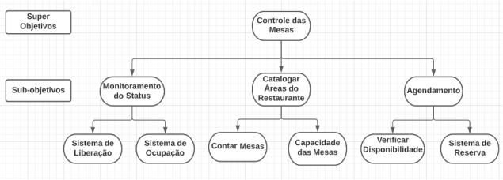
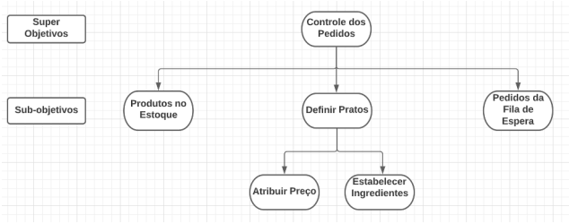
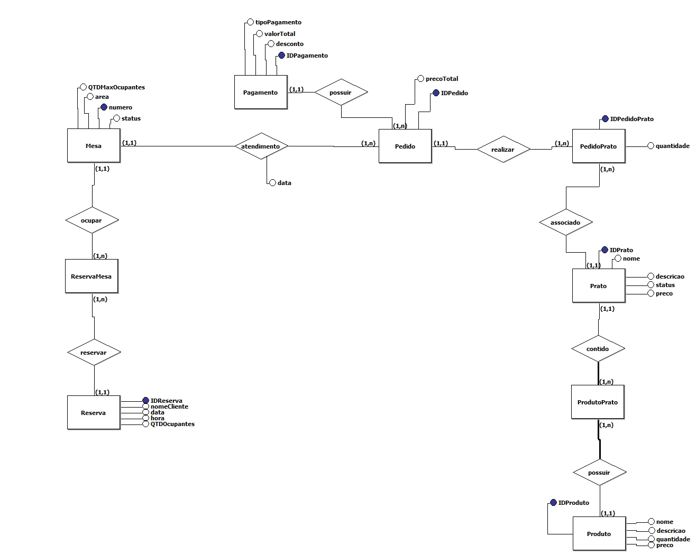

# Especificação do Projeto

## Diagrama de Objetivos





## Diagrama Entidade Relacionamento




## Modelo Relacional

````MySQL

Mesa(numero, area, QTDMaxOcupantes)
Pagamento(IDPagamento, desconto, tipoPagamento)
Pedido(IDPedido, numeroFK, IDpagamentoFK, data)

ReservaMesa(numeroFK, IDReservaFK)
Reserva(IDReserva, nomeCliente, data, hora, QTDOcupantes)


PedidoPrato(IDPedidoFK, IDPratoFK, data, quantidade)
Prato(IDPrato, nome, preco, tipo)

ProdutoPrato(IDPratoFK, IDProdutoFK)
Produto(IDProduto, nome, preco, fornecedor)

````